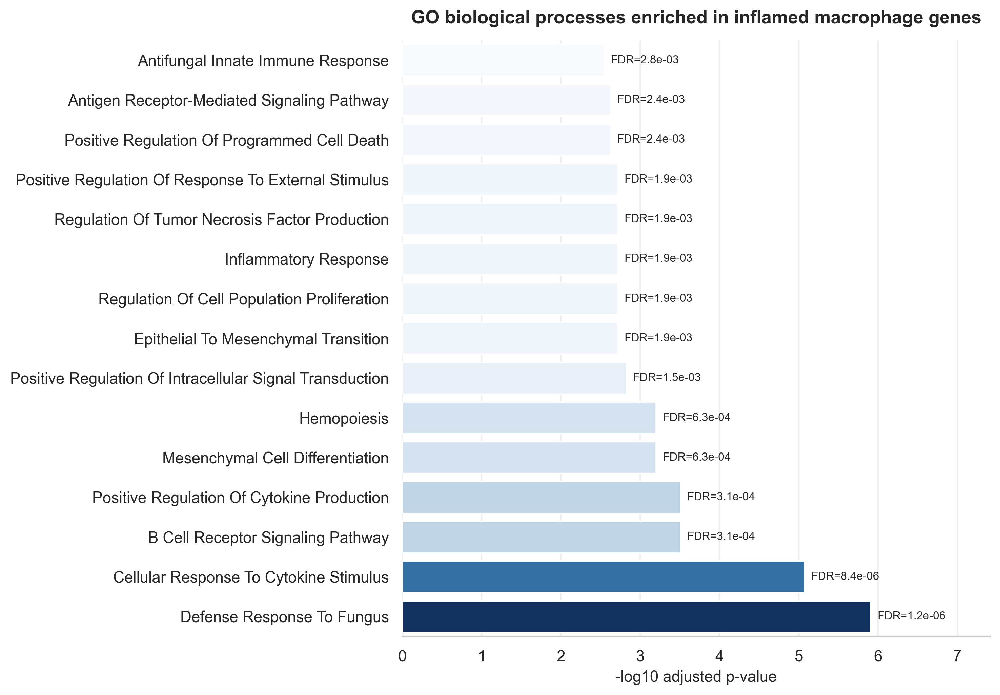

# scRNAseq Immune Atlas

Single-cell RNA-seq analysis of immune remodeling in inflammatory bowel disease using Python and Scanpy.

## Project Goal

This project analyzes public single-cell RNA-seq data from inflammatory bowel disease intestinal tissue to explore how immune cell populations and transcriptional states differ between healthy, non-inflamed, and inflamed samples.

The current analysis focuses on the immune-cell compartment, with downstream emphasis on macrophage inflammatory programs in ulcerative colitis-associated colon tissue.

## Biological Questions

- Which immune cell populations are present in healthy and IBD-associated intestinal tissue?
- How does immune cell composition differ across healthy, non-inflamed, and inflamed tissue?
- Do annotated immune clusters express expected canonical marker genes?
- Which macrophage genes are associated with inflamed intestinal tissue?
- Which biological pathways are enriched among genes upregulated in inflamed macrophages?

## Completed Analysis

### 1. Data Exploration

Loaded immune-cell single-cell RNA-seq data, aligned expression data with metadata, and summarized immune cell composition across tissue conditions.

Outputs include:

- Immune cell composition table by condition
- Composition change table comparing healthy and inflamed tissue
- Heatmap of major immune cell populations across healthy, non-inflamed, and inflamed samples

### 2. Marker Gene Analysis

Identified marker genes for annotated immune clusters and validated major immune identities using canonical marker genes.

Key findings:

- T cell clusters express `CD3D`, `CD3E`, and `TRAC`
- Regulatory T cells show markers including `FOXP3`, `IL2RA`, and `CTLA4`
- B/plasma cell populations show `MS4A1`, `CD79A`, `MZB1`, and `JCHAIN`
- Myeloid populations show `LYZ`, `S100A8`, and `S100A9`
- Mast cell clusters show `TPSAB1` and `KIT`

### 3. Disease-Associated Expression Analysis

Compared macrophage gene expression between inflamed and healthy tissue.

Initial findings suggest that inflamed macrophages show stronger expression of inflammatory myeloid genes including:

- `S100A8`
- `S100A9`
- `S100A6`
- `LYZ`

These genes support the presence of disease-associated inflammatory macrophage states in IBD tissue.

### 4. Pathway Enrichment Analysis

Performed Gene Ontology enrichment analysis on genes upregulated in inflamed macrophages compared with healthy macrophages.

Initial enrichment results included broad translation and gene expression terms driven by ribosomal genes. After filtering ribosomal, mitochondrial, and broad non-coding RNA genes, enriched processes were more specific to immune activation.

Key enriched processes included:

- Cellular response to cytokine stimulus
- Positive regulation of cytokine production
- Regulation of tumor necrosis factor production
- Inflammatory response
- Innate immune defense programs

These pathway-level results support the interpretation that inflamed intestinal macrophages show transcriptional programs associated with cytokine responsiveness, inflammatory activation, and innate immune defense.

## Repository Structure

```text
app/                 Streamlit dashboard prototype
data/                Raw and processed data, not tracked in Git
notebooks/           Analysis notebooks
results/figures/     Saved figures
results/tables/      Saved result tables
src/immune_atlas/    Reusable project code
```

## Notebooks

```text
01_data_exploration.ipynb
```

Loads the immune-cell dataset, attaches metadata, summarizes tissue conditions, and explores immune cell composition.

```text
02_marker_gene_analysis.ipynb
```

Identifies marker genes for immune clusters and validates immune cell annotations using canonical marker genes.

```text
03_disease_associated_expression.ipynb
```

Compares macrophage gene expression between healthy and inflamed tissue to identify disease-associated inflammatory programs.

```text
04_pathway_enrichment_analysis.ipynb
```

Performs Gene Ontology enrichment analysis on macrophage genes upregulated in inflamed tissue and identifies inflammatory immune pathways.

## Results

Key outputs are saved in:

```text
results/figures/
results/tables/
```

The analysis currently includes immune composition summaries, marker gene validation, macrophage differential expression, and macrophage pathway enrichment.

## Example Figures

### Immune Cell Composition Across Tissue Conditions


### Canonical Immune Marker Validation


### Macrophage Inflammatory Gene Expression


### Macrophage Pathway Enrichment



## Tools

- Python
- Scanpy
- AnnData
- pandas
- NumPy
- matplotlib
- seaborn
- gseapy
- scikit-learn
- Streamlit

## Dataset

This project uses a public single-cell RNA-seq dataset from inflammatory bowel disease intestinal tissue. The analysis currently focuses on the immune-cell compartment.

Large raw and processed data files are not committed to this repository. The repository tracks notebooks, code, figures, and result tables.


Next steps:

- Extend disease-associated expression analysis to additional immune populations
- Add pathway enrichment for additional cell types
- Improve reusable analysis code in `src/immune_atlas/`
- Build a Streamlit dashboard for exploring immune clusters, marker genes, and disease-associated pathways
```